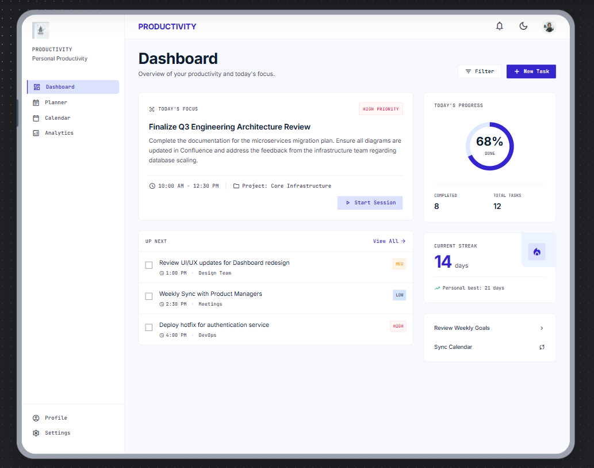
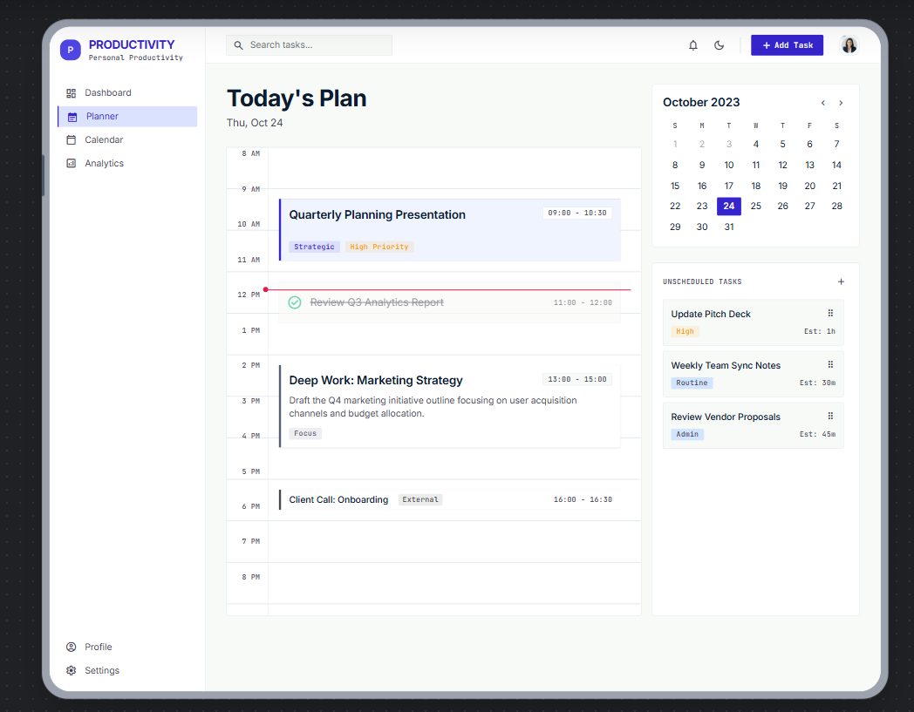
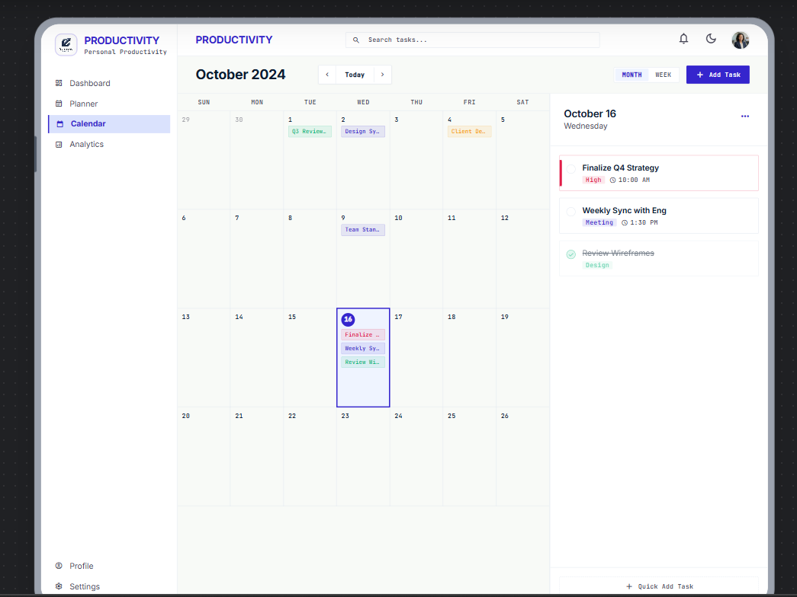
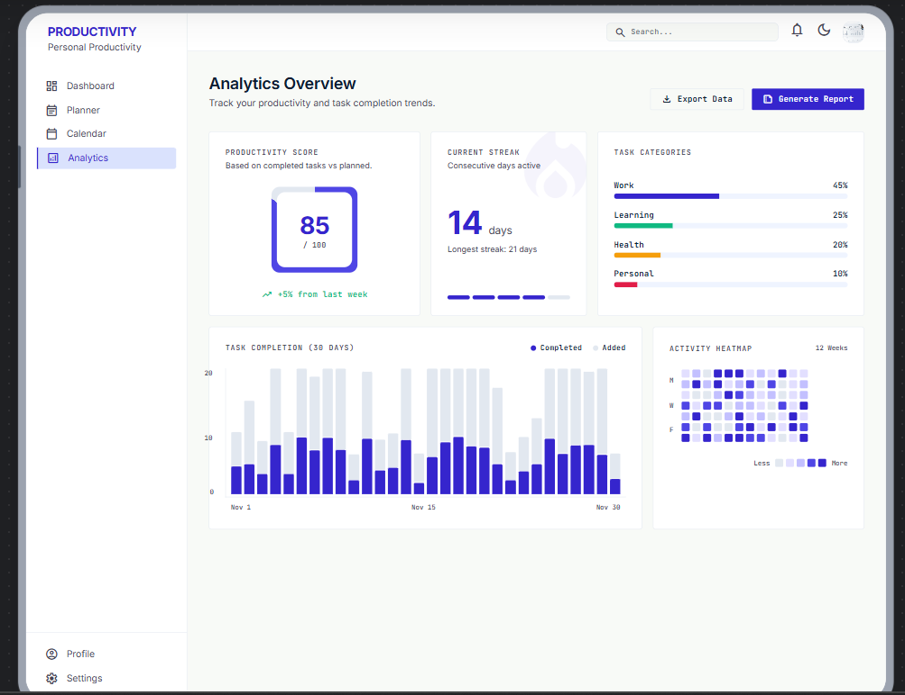
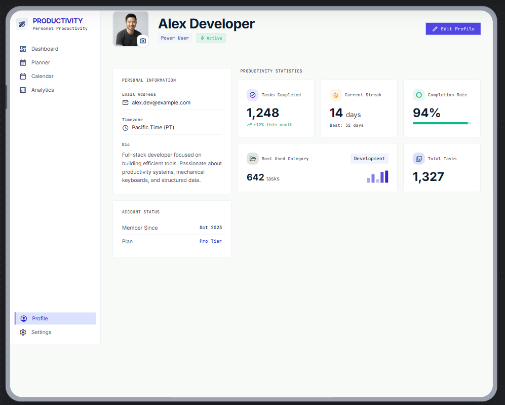
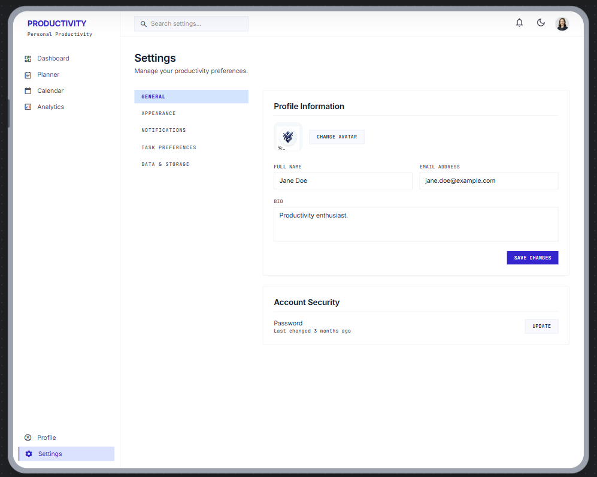

# Productivity Tracker

> A modern personal productivity workspace built with React.js and Material UI.

Productivity Tracker is a personal task management and productivity application designed to help users plan their day, organize tasks, track completion, manage priorities, and understand their productivity through a clean and responsive interface.

---

## ✨ Features

### 📊 Dashboard

- Daily productivity overview
- Task progress tracking
- Completed and pending task summary
- Current and upcoming tasks
- Productivity insights
- Dynamic greeting

### 📋 Planner

- Create new tasks
- Edit tasks
- Delete tasks
- Mark tasks as completed
- Task categories
- Task priorities
- Search tasks
- Filter tasks
- Sort tasks
- Task activities
- Responsive task cards

### 📅 Calendar

- Monthly calendar view
- Previous / next month navigation
- Jump to today
- View tasks by date
- Task details dialog
- Responsive calendar layout

### 📈 Analytics

- Total tasks
- Completed tasks
- Pending tasks
- Completion rate
- Tasks by category
- Tasks by priority

### 👤 Profile

- Personal profile
- Developer information
- Technology overview
- GitHub profile
- LinkedIn profile

### ⚙️ Settings

- Default task priority
- Completed task visibility
- Local data management
- Clear task data

### 🆘 Help & Support

- Dedicated Help & Support page
- Application guidance
- Developer information

### 🎨 UI / UX

- Modern Material UI design
- Responsive layout
- Light / Dark theme
- Responsive sidebar
- Mobile-friendly interface
- Interactive cards
- Modern developer profile dialog
- Animated application branding

---

# 🖥️ UI Preview

## Dashboard



## Planner



## Calendar



## Analytics



## Profile



## Settings



---

# 🛠️ Tech Stack

## Frontend

- React.js
- JavaScript
- Material UI
- React Router
- Vite

## State Management

- React Context API
- Custom React Hooks

## Data Persistence

- Browser LocalStorage

## Development Tools

- Git
- GitHub
- Visual Studio Code
- Chrome DevTools

---

# 📂 Project Structure

```text
Productivity Tracker/
│
├── frontend/
│   ├── public/
│   ├── src/
│   │   ├── components/
│   │   ├── constants/
│   │   ├── context/
│   │   ├── hooks/
│   │   ├── layouts/
│   │   ├── pages/
│   │   └── utils/
│   │
│   ├── package.json
│   ├── package-lock.json
│   ├── vite.config.js
│   └── eslint.config.js
│
├── ui-theme/
│   ├── w-dashboard.png
│   ├── w-planner.png
│   ├── w-calendar.png
│   ├── w-analytics.png
│   ├── w-profile.png
│   └── w-settings.png
│
├── docs/
│
├── .gitignore
└── README.md